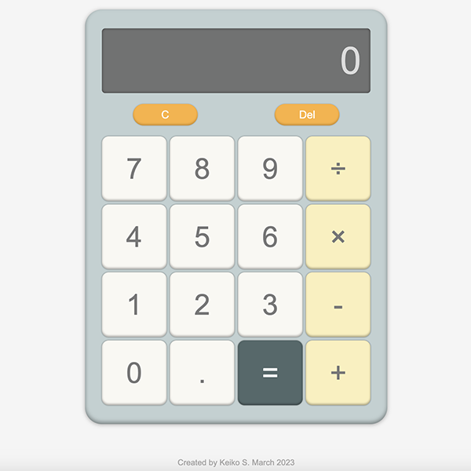

# odin-calculator
## Project: Calculator / The Odin Project
 

   

 

## Summary ##
In this project, I developed an online calculator using HTML, CSS, and JavaScript, incorporating the skills I acquired from previous lessons. The project details are available [here](https://www.theodinproject.com/lessons/foundations-calculator).

Upon completion, the calculator should have the following features:

#### Basic Requirements ####
1. Functions for basic math calculations, such as addition, subtraction, multiplication, and division.
2. Variables to store the first operand, an operator, and the second operand for calculations. 
3. An 'operate' function that takes two operands and an operator as arguments, then calls the appropriate function based on the given operator. 
4. A function that populates the display when a user clicks digit buttons. 
5. Storage of the first operand and operator in designated variables upon clicking operator buttons. 
6. The 'operate' function should be called when the '=' button is clicked, with all required values stored in variables, and the result displayed. 
7. The HTML should include buttons for each digit, operator, equals, clear, and a display.
#### Key Considerations ####
* Users should be able to perform sequential calculations and obtain a final solution. 
* The calculator must display the result of each single set of operands and operator, followed by the next solution. 
* Solutions with long decimals should be rounded to prevent overflow in the display. 
* Address issues caused by clicking the '=' button in unusual flows. 
* The clear button should reset all previous data, allowing for a fresh start. 
* The divide function should display an 'error' message when a user attempts to divide by 0. 
#### Extra Credit ####
- Add a decimal point button. 
- Add a delete button. 
- Enable keyboard support. 
- Enhance the calculator's appearance.  

 

My final product can be found [here](https://kbelltree.github.io/odin-calculator/). 

  

I employed new skills while working on this project. I also utilized ChatGPT4 to search for some code solutions, which are outlined below.

#### Problem Solving ####
   * Recognize problems
   * Plan
   * Write pseudocode
   * Divide and conquer
#### Error Correction ####
   * Use Chrome Developer Tools
   * Use console.log()
   * Web search for a solution
#### Clean Code Writing ####
   * Use consistent indentation
   * Use semicolons 
   * Be mindful of line length
   * Employ descriptive and consistent naming
#### Javascript Basics ####
   * (New) Use ternary operator
   * (New) Use default parameter: learned from ChatGPT4
   * (New) Use string, number, and array methods
   * (New) Utilize object: learned from ChatGPT4
   * (New) Distinguish function declaration and expression
   * Link Javascript in a webpage   
   * Understand variables, numbers, and operators 
   * Understand 8 primitive data and 1 non-primitive data types
   * Understand conditionals 
   * Understand methods
   * Understand loops
   * Understand functions
#### DOM Manipulation ####
   * (New) Utilize event delegation: learned from ChatGPT4 
   * (New) Use e.key and Keydown event: leaned from ChatGPT4 
   * (New) Use e.target.closest: learned from ChatGPT4
   * Modify html content  
   * Use eventListeners 
#### CSS Styling ####
   * (New) Trim text overflow 
   * Create a grid
   * Make a square in the grid
   * Use 'em'  
   * Revisit flexbox method
   * Style buttons with effects

 

***

**Tools Used**
  - UI Designing Tool by [Figma.com](https://www.figma.com)
  - CSS Box Shadow Generator by [Front-end Tools](https://front-end-tools.com/en/generateboxshadow/)
  - Javascript Key Code by [Toptal](https://www.toptal.com/developers/keycode)
  - ChatGPT4 by [OpenAI](https://chat.openai.com)
  - Pixel to Em Converter by [w3schools](https://www.w3schools.com/tags/ref_pxtoemconversion.asp)
  - Google Sheet by [Google](https://www.google.com/drive/)
  - Palette Generator by [Dopely Colors](https://colors.dopely.top/palette-generator/mzrKkjK5cJo)
  

 

**List of Referenced Tutorials**

- ['CSS 2D Transforms' by W3Schools](https://www.w3schools.com/css/css3_2dtransforms.asp)

- ['How to add a pressed effect on button click in CSS?' by geeksforgeeks](https://www.geeksforgeeks.org/how-to-add-a-pressed-effect-on-button-click-in-css/)

- ['box-shadow' by CSS-Tricks](https://css-tricks.com/almanac/properties/b/box-shadow/)

- ['text-overflow' by MDN](https://developer.mozilla.org/en-US/docs/Web/CSS/text-overflow)

- ['A look at the Array.reduce() function' by CodinGame](https://www.codingame.com/playgrounds/5474/a-look-at-the-array-reduce-function)

- ['JavaScript Convert String to Number – JS String to Int Example' by freeCodeCamp](https://www.freecodecamp.org/news/javascript-convert-string-to-number-js-string-to-int-example/)

- ['JavaScript Number toPrecision()' by W3Schools](https://www.w3schools.com/jsref/jsref_toprecision.asp)

- ['Understanding event bubbling, capturing and delegation in JavaScript' by 30 seconds of code](https://www.30secondsofcode.org/articles/s/javascript-event-bubbling-capturing-delegation/)

- ['How to Check if a String Contains a Character in JavaScript' by Coding Beauty](https://javascript.plainenglish.io/javascript-check-if-string-contains-character-1f6b77394ca5)

- ['KeyboardEvent key Property' by W3Schools](https://www.w3schools.com/jsref/event_key_key.asp)

- ['Default parameters' by MDN](https://developer.mozilla.org/en-US/docs/Web/JavaScript/Reference/Functions/Default_parameters)

- ['parseFloat()' by MDN](https://developer.mozilla.org/en-US/docs/Web/JavaScript/Reference/Global_Objects/parseFloat#using_parsefloat)

- ['Number.prototype.toExponential()' by MDN](https://developer.mozilla.org/en-US/docs/Web/JavaScript/Reference/Global_Objects/Number/toExponential)

 

